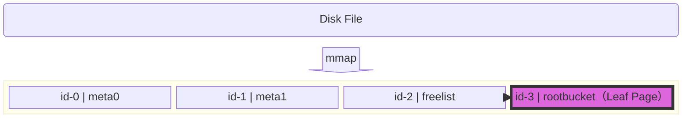
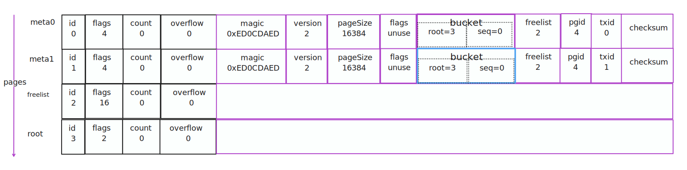
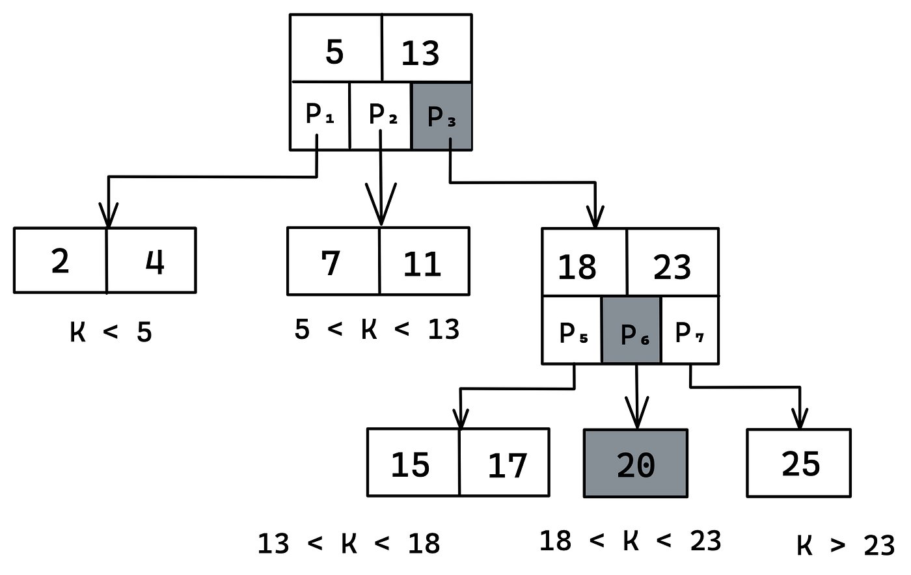
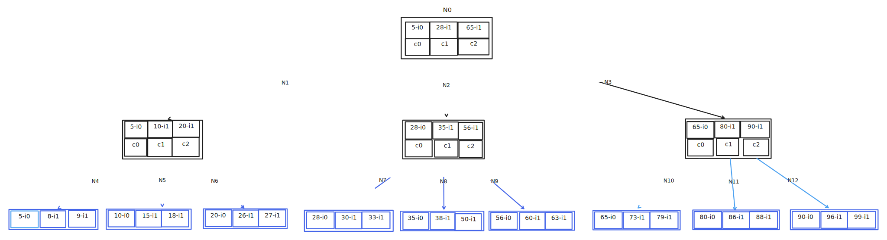

## 内部结构

### 初始化时，Page内部结构



Page如下

````rust
meta0:page.Page{ .id = 0, .flags = 4, .count = 0, .overflow = 0 }
meta1:page.Page{ .id = 1, .flags = 4, .count = 0, .overflow = 0 }
rootBucket:page.Page{ .id = 3, .flags = 2, .count = 0, .overflow = 0 }
freelist:page.Page{ .id = 2, .flags = 16, .count = 0, .overflow = 0 }
````



创建一个Bucket：*widgets*

- 创建tx

  ```go
  txid = 2, 
  type Tx struct {
  	meta           *meta = meta1
    	root           Bucket = struct {
      					tx: self, 
      					rootNode:bucket = {
                           	root = 3,
                            	seq = 0,
                          }
  				}         
  }  
  ```
  


## B+ Tree

	

### Find



#### Find 20

 - 检索N0，中间节点，fIndex=0，即c0
 - 检索N1，中间节点，找到key=20，fIndex=2，即c2
 - 检索N5，叶子节点，且检索到20，即找到目标值

#### Find 53

 - 检索N0，中间节点，fIndex=1，即c1
 - 检索N2，中间节点，fIndex=1，即c1
 - 检索N6，叶子点，且未找到53，即未找到目标值

检索到的节点为branch，需要二级跳转，

## Insert

如何找到適合的插入位置：

- 检索对应的叶子节点

  ```go
  index := sort.Search(len(n.inodes), func(i int) bool {
      return bytes.Compare(n.inodes[i].key, key) != -1
  })
  ```

- 从叶子中找出对应的位置

  ```go
  index := sort.Search(len(n.inodes), func(i int) bool {return bytes.Compare(n.inodes[i].key, oldKey) != 1})
  ```

  即找出一個  `inodes[i].key >= key`的位置。

  	- 如果找到的位置inode.key == key，不用*扩容*，直接填充新数覆盖即可
  	- 如果找到的位置大于叶子节点数，或者对应的位置inode,key != key，需要扩容，然后填充新数据即可

至此，数据已被插入到对应的叶子节点。

### Insert 4

- 检索到N4-5-i0 >= 4
- N4=》4-i0，5-i1，8-i2，9-i3

### Insert 100

- 检索到N8
- N8=〉 90-i0，96-i1，99-i2，100-i3

### Insert 37

- 检索到N7

### Rebalance


节点平衡发生在tx.Commit时.

example: 假设插入一个key=4，插入到N4，N4 = 【4-i0，5-i1，8-i2，9-i3】，检索的堆栈如下：`N0 -》 N1 -〉 N4`

#### 节点平衡

```go
// rebalance attempts to balance all nodes.
func (b *Bucket) rebalance() {
	for _, n := range b.nodes {
		n.rebalance()
	}
	for _, child := range b.buckets {
		child.rebalance()
	}
}
```

这个b.nodes从那里来的？比如一个Put操作。

```go
// node returns the node that the cursor is currently positioned on.
func (c *Cursor) node() *node {
	_assert(len(c.stack) > 0, "accessing a node with a zero-length cursor stack")

	// If the top of the stack is a leaf node then just return it.
	if ref := &c.stack[len(c.stack)-1]; ref.node != nil && ref.isLeaf() {
		return ref.node
	}

	// Start from root and traverse down the hierarchy.
	var n = c.stack[0].node
	if n == nil {
		n = c.bucket.node(c.stack[0].page.id, nil)
	}
	for _, ref := range c.stack[:len(c.stack)-1] {
		_assert(!n.isLeaf, "expected branch node")
		n = n.childAt(ref.index)
	}
	_assert(n.isLeaf, "expected leaf node")
	return n
}
```

具体以一个简单的例子来展示整个过程。

- 数据初始化，其数据布局


- 启动一个writable事务，比如db.Update

  对应的交易对象如下：

  ```go
  txid = 2, 
  type Tx struct {
  	meta           *meta = meta1
    Bucket = struct {
      	tx: self, 
      	rootNode:bucket = {
           root = 3,
           seq = 0,
        }
  	}         
  } 
  ```

- CreateNewBucket：创建新bucket

  - b.Cursor() 创建游标

  - 如图所示，从root（top bucket），开始检索

  - 未检索到对应的key，即可以新建一个子bucket

    ```go
    	var bucket = Bucket{
    		bucket:      &bucket{},
    		rootNode:    &node{isLeaf: true},
    		FillPercent: DefaultFillPercent,
    	}
    ```

    > 1.可以看到新建的bucket是inline bucket，其对应的底层存储也是一个叶子节点。
    >
    > 2.和其他节点一样，新建的节点使用的是node，而不是page，这里的rootNode也是一样的道理
    >
    > 3.游标什么时候用node，什么时候用page？如果是“读”操作，只用page即可，如果是“写”操作，用node来替换。因为涉及到内存的变动，比如增加，删除，平衡等。

  - 将bucket写入一块内存中： var value = bucket.write()

    请参考[这个段落](#Write a bucket Into slice)。

  - 将对应的节点node写入到cursor的合适位置上，就是一个B+叔正常的插入过程

    > 注意这里会把检索路径节点都转为node，而不是page

  - 此时这个b+树如何？

    ```mermaid
    flowchart TD
      n7("i0-widgets(NewBucketName, Leaf Node)")
    ```


​		

#### Buckets平衡

### Spill

### Merge

### Delete

## Write a bucket Into slice

<a name="Write a bucket Into slice"></a>

```go
// write allocates and writes a bucket to a byte slice.
func (b *Bucket) write() []byte {
	// Allocate the appropriate size.
	var n = b.rootNode
	var value = make([]byte, bucketHeaderSize+n.size())

	// Write a bucket header.
	var bucket = (*bucket)(unsafe.Pointer(&value[0]))
	*bucket = *b.bucket

	// Convert byte slice to a fake page and write the root node.
	var p = (*page)(unsafe.Pointer(&value[bucketHeaderSize]))
	n.write(p)

	return value
}
```

底层结构

```
|bucketHeader|page|
```

