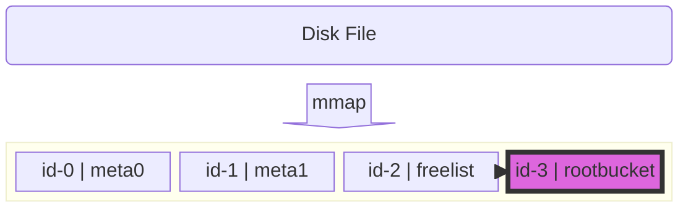
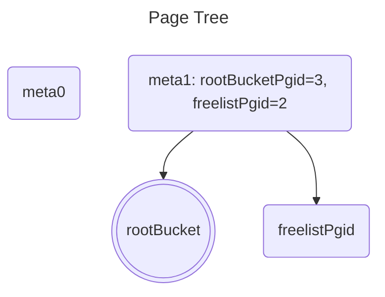

## 内部结构

### 初始化时



Page如下

````rust
meta0:page.Page{ .id = 0, .flags = 4, .count = 0, .overflow = 0 }
meta1:page.Page{ .id = 1, .flags = 4, .count = 0, .overflow = 0 }
rootBucket:page.Page{ .id = 3, .flags = 2, .count = 0, .overflow = 0 }
freelist:page.Page{ .id = 2, .flags = 16, .count = 0, .overflow = 0 }
````




