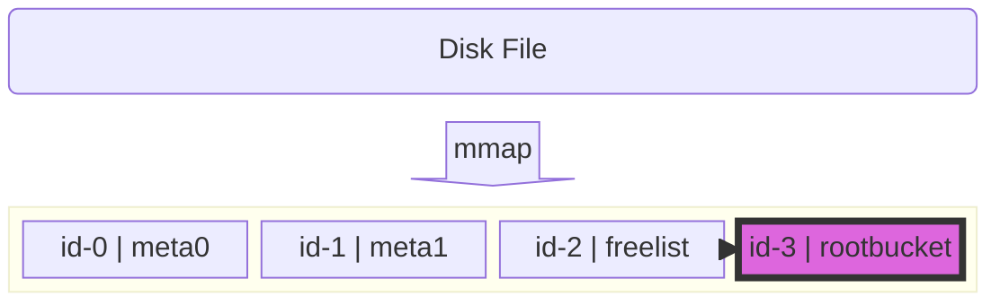
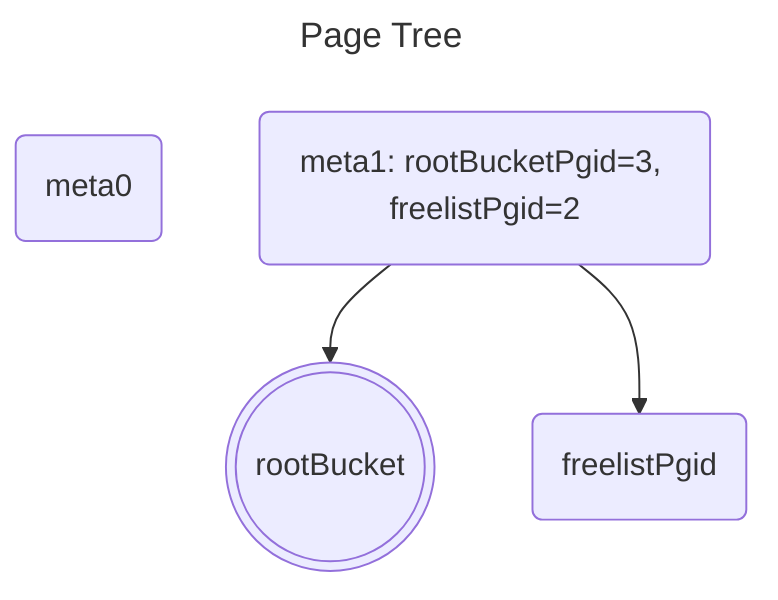
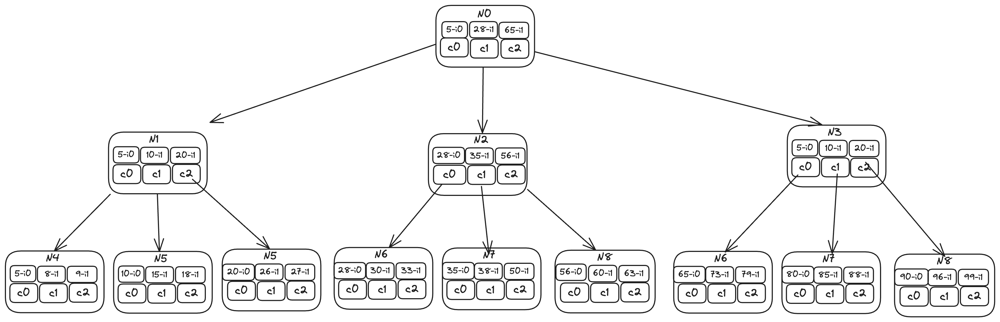
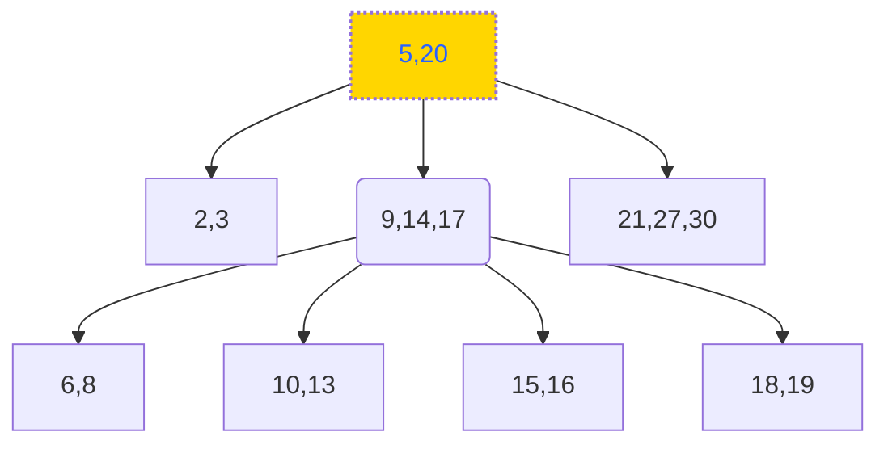

## 内部结构

### 初始化时



Page如下

````rust
meta0:page.Page{ .id = 0, .flags = 4, .count = 0, .overflow = 0 }
meta1:page.Page{ .id = 1, .flags = 4, .count = 0, .overflow = 0 }
rootBucket:page.Page{ .id = 3, .flags = 2, .count = 0, .overflow = 0 }
freelist:page.Page{ .id = 2, .flags = 16, .count = 0, .overflow = 0 }
````




## B+ Tree

	

### Find



#### Find 20

 - 检索N0，中间节点，fIndex=0，即c0
 - 检索N1，中间节点，找到key=20，fIndex=2，即c2
 - 检索N5，叶子节点，且检索到20，即找到目标值

#### Find 53

 - 检索N0，中间节点，fIndex=1，即c1
 - 检索N2，中间节点，fIndex=1，即c1
 - 检索N6，叶子点，且未找到53，即未找到目标值

检索到的节点为branch，需要二级跳转，

## Insert

	### Insert 4

- 检索到N4
- N4=》4-i0，5-i1，8-i2，9-i3

### Insert 100

- 检索到N8
- N8=〉 90-i0，96-i1，99-i2，100-i3

### Insert 37

- 检索到N7

### Rebalance

### Spill

### Merge


### Delete



- 删除分支节点20:
  - 
