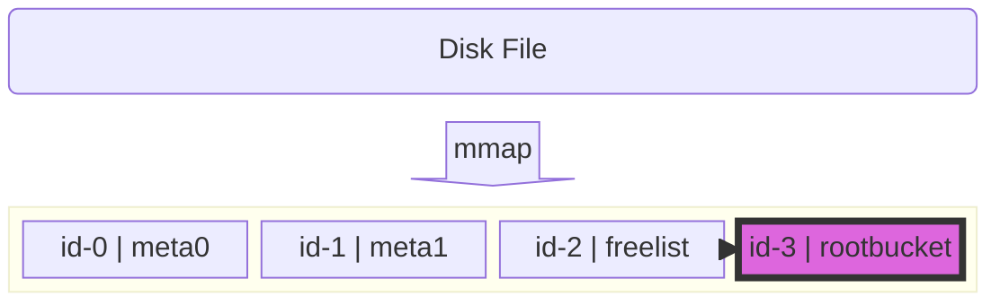
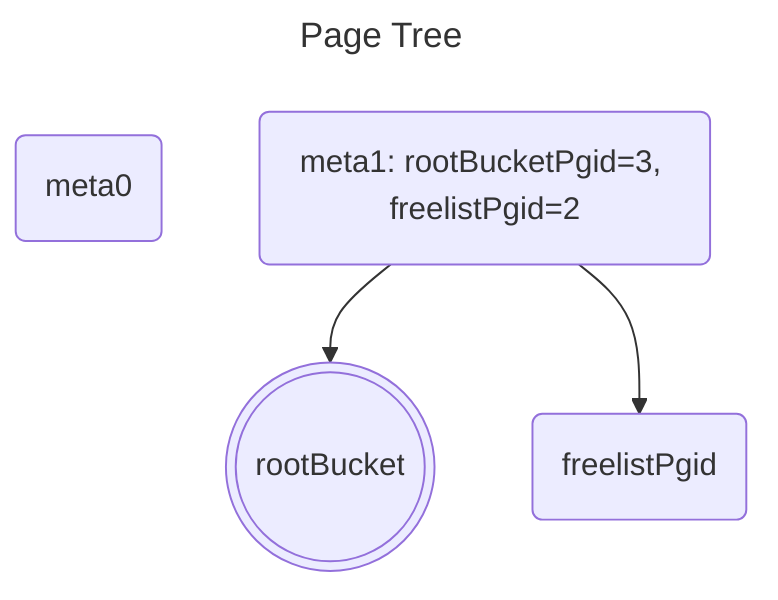
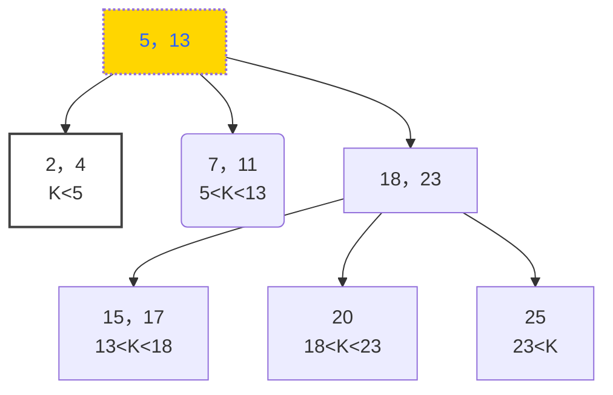
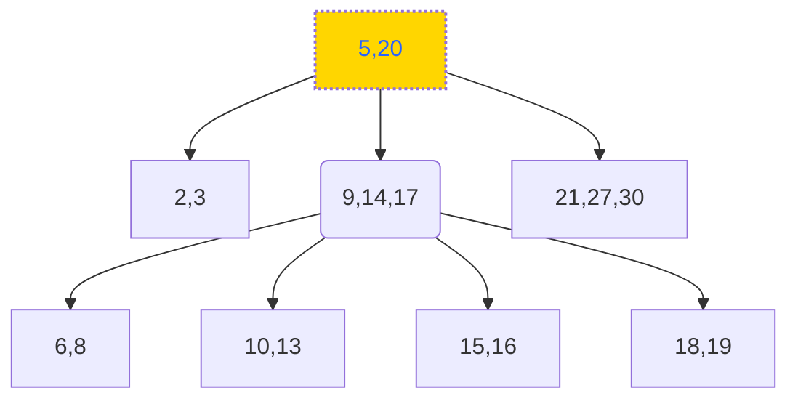

## 内部结构

### 初始化时



Page如下

````rust
meta0:page.Page{ .id = 0, .flags = 4, .count = 0, .overflow = 0 }
meta1:page.Page{ .id = 1, .flags = 4, .count = 0, .overflow = 0 }
rootBucket:page.Page{ .id = 3, .flags = 2, .count = 0, .overflow = 0 }
freelist:page.Page{ .id = 2, .flags = 16, .count = 0, .overflow = 0 }
````




## B+ Tree

	

### Find



#### Find 20

 - 检索【5，13】，中间节点，fIndex=2（大于13，到了边界）
 - 检索【18，23】，中间节点，fIndex=1
 - 检索【20】，等于20，返回

#### Find 18

 - 检索【5，13】，中间节点，fIndex=2
 - 检索【18，23】，找到目标节点，返回

检索到的节点为branch，需要二级跳转，

### Rebalance

### Spill

### Merge


### Delete



- 删除分支节点20:
  - 
